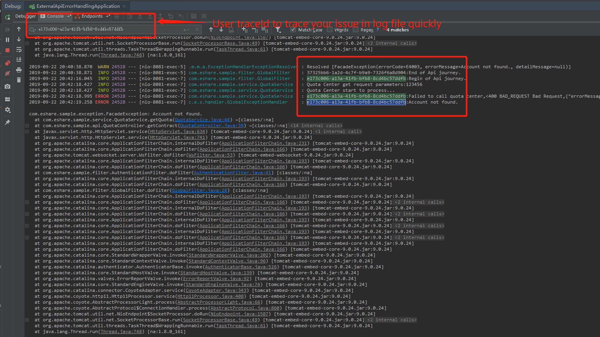

# api-error-handling-best-practices
There're some best practices of error handling for External API and make you simplify your troubleshooting in production.

# **TEST CASE**

## **external-api-error-handling-simple**
- 1.InvalidAuthenticationException
  - Request Method: Get
  - Request URL: http://localhost:8081/quota 
  - Request parameters:
    - Header: api-profile-id:null
  - Result: 
  ```java
  {
    "errorCode": "E4002",
    "errorMessage": "Not authentication for Current API.",
    "traceId": "15cea764-8865-418d-b05f-1c395f6a4d96"
  }
  ```
- 2.Validation Exception
  - Request Method: Post
  - Request URL: http://localhost:8081/quota 
  - Request parameters:
    - Header: api-profile-id:123456
    - Request body:
    ```java
    {"customerId":""}
    ```
  - Result: 
  ```java
  {
    "traceId": "9a97dae0-959b-41a9-90de-70687da390d9",
    "errorCode": "E4001",
    "errorMessage": "Invalid Format.The request format is invalid",
    "errorDetails": [
      "customerId can not be blank.,invalid value: ;",
      "quotaLimit can not be blank.,invalid value: null;",
      "quotaBalance can not be blank.,invalid value: null;"
    ]
  }
  ```
 - 3.FacadeException
   - Request Method: Get
   - Request URL: http://localhost:8081/quota?customerId=123456
   - Request parameters:
     - Header: api-profile-id:null
   - Result: 
   ```java
   {
   	"traceId": "e173c006-a13a-41fb-bfb8-8cd4bc57ddfb",
   	"errorCode": "E4003",
   	"errorMessage": "Account not found.",
   	"errorDetails": null
   }
   ```
## **Use traceId to troubleshoot issue**   
It's very easy to troubleshoot by traceId in your log file now.


